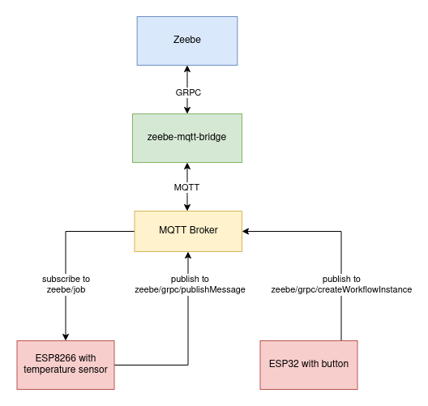
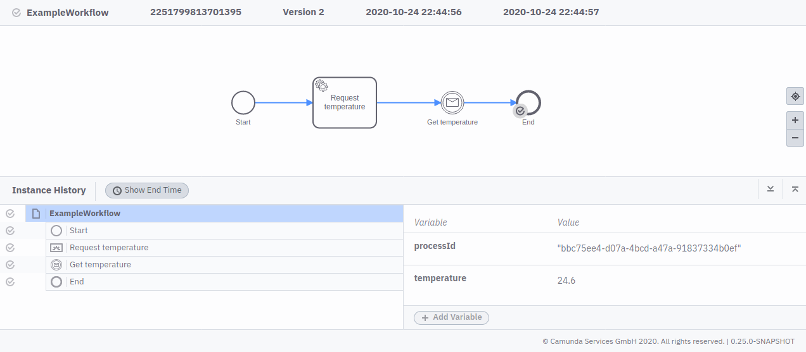

# zeebe-microcontroller
This is a PoC that microcontrollers can be used with Zeebe

In this example one microcontroller (ESP32) creates a BPMN workflow instance every time an attached button is pressed.
The second microcontroller (ESP8266) acts as a job worker publishing the current temperature, which is then available as variable in the workflow instance in Zeebe.




## Why Microcontrollers?

ESP32 and ESP8266 microcontrollers by Espressif Systems are widely used in Internet of Things (IoT) projects. They have WiFi on board and a bunch of GPIO pins to connect sensors, buttons, LEDs or servo motors. There are different low cost development boards are available, while the microcontroller chip itself is even cheaper.

## Requirements

* running Zeebe instance
* running MQTT server
* following microcontrollers flashed with MicroPython:
    * ESP32 with attached button
    * ESP8266 with attached TMP36 temperature sensor

## Deploy example workflow to zeebe

```bash
zbctl --insecure deploy resources/example.bpmn
```

## Running python-mqtt-bridge

```bash
cd python-mqtt-bridge
python3 -m venv ./env
source env/bin/activate
pip install -r requirements.txt
python3 src/python-mqtt-bridge
```

## ESP32 / ESP8266

Please add WiFi and MQTT credentials to main.py before uploading to microcontroller.

## Resources

### Tutorials for MicroPython on ESP32, ESP8266 Microcontrollers
https://docs.micropython.org/en/latest/esp32/tutorial/intro.html  
https://docs.micropython.org/en/latest/esp8266/tutorial/intro.html

### Zeebe docs
https://docs.zeebe.io/  
https://gitlab.com/stephane.ludwig/zeebe_python_grpc

### Zeebe modeler
https://github.com/zeebe-io/zeebe-modeler


