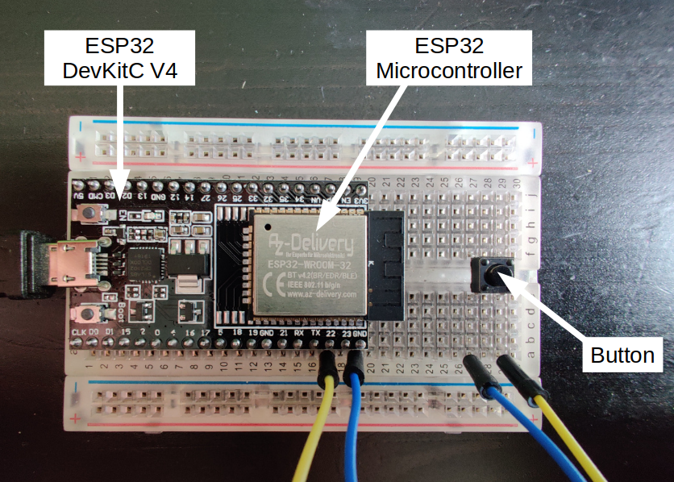
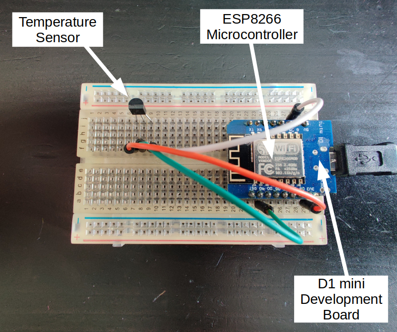

# zeebe-microcontroller
This is a PoC that microcontrollers can be used with Zeebe

In this example one microcontroller (ESP32) creates a BPMN workflow instance every time an attached button is pressed.
A second microcontroller (ESP8266) acts as a job worker publishing the current temperature, which is then available as variable in the workflow instance in Zeebe.


The main ingredient is the [zeebe-mqtt-bridge](zeebe-mqtt-bridge/src/zeebe-mqtt-bridge.py) python script which serves the following purposes: 

* subscribe to Zeebe as job worker via GRPC
* publish jobs via MQTT
* subscribe to MQTT and listens for messages
* publish messages to Zeebe via GRPC


## Why Microcontrollers?

ESP32 and ESP8266 microcontrollers by Espressif Systems are widely used in Internet of Things (IoT) projects. They have WiFi on board and a bunch of GPIO pins to connect sensors, buttons, LEDs or servo motors. There are different low cost development boards are available, while the microcontroller chip itself is even cheaper.

Please note that both microcontroller types can serve both purposes (button and temperature sensor), it's just a proof of concept, that both microcontrollers can be used to communicate with Zeebe via MQTT.

## Requirements

* a running Zeebe instance
* a running MQTT server
* the following microcontrollers flashed with MicroPython:
    * ESP32 with attached button
    * ESP8266 with attached TMP36 temperature sensor

## ESP32 Microcontroller

The ESP32 needs to be flashed with MicroPython firmware (see https://docs.micropython.org/en/latest/esp32/tutorial/intro.html).

Please add WiFi and MQTT credentials to [esp32/main.py](esp32/main.py) and upload the script to the microcontroller.



## ESP8266 Microcontroller

The ESP8266 needs to be flashed with MicroPython firmware (see https://docs.micropython.org/en/latest/esp8266/tutorial/intro.html).

Please add WiFi and MQTT credentials to [esp8266/main.py](esp8266/main.py) and upload the script to the microcontroller.



## Deploy example workflow to zeebe

```bash
zbctl --insecure deploy resources/example.bpmn
```

## Running zeebe-mqtt-bridge

```bash
cd zeebe-mqtt-bridge
python3 -m venv ./env
source env/bin/activate
pip install -r requirements.txt
python3 src/zeebe-mqtt-bridge
```

## Resources

### Tutorials for MicroPython on ESP32, ESP8266 Microcontrollers
https://docs.micropython.org/en/latest/esp32/tutorial/intro.html  
https://docs.micropython.org/en/latest/esp8266/tutorial/intro.html

### Zeebe docs
https://docs.zeebe.io/  
https://gitlab.com/stephane.ludwig/zeebe_python_grpc

### Zeebe modeler
https://github.com/zeebe-io/zeebe-modeler


